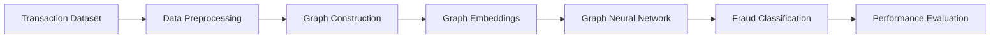

# 🛡️ Fraud Detection in Decentralized Finance using GNN & Graph Embeddings


> 🚀 An advanced **DeFi Fraud Detection System** leveraging **Graph Neural Networks (GNNs)** and **Graph Embeddings** to identify suspicious blockchain transaction patterns and fraudulent wallet behaviors.

---

## 📌 Project Overview

Decentralized Finance (DeFi) platforms process thousands of transactions daily, making fraud detection extremely challenging using traditional machine learning methods.

This project introduces a **graph-based fraud detection framework** where:

- Wallets are represented as **nodes**
- Transactions are represented as **edges**
- Suspicious behavioral patterns are learned using:
  - **Graph Neural Networks (GNN)**
  - **Node Embeddings**
  - **Graph Analytics**

The system detects fraudulent activities by learning hidden relationships between blockchain transactions.

---

# ✨ Key Features

✅ Fraud Detection using Graph Learning  
✅ Graph Embedding-based Feature Engineering  
✅ Wallet Interaction Network Analysis  
✅ High Accuracy Classification Model  
✅ Data Preprocessing & Visualization  
✅ Scalable for Large Blockchain Networks  
✅ Google Colab Ready Implementation  

---

# 🧠 Tech Stack

| Category | Technologies |
|---|---|
| Programming Language | Python |
| Deep Learning | PyTorch |
| Graph Learning | PyTorch Geometric |
| Graph Analysis | NetworkX |
| Data Processing | Pandas, NumPy |
| Visualization | Matplotlib, Seaborn |
| Environment | Google Colab |
| Version Control | Git & GitHub |

---

# 📂 Project Structure

```bash
Fraud-Detection-DeFi-GNN/
│
├── data/
│   ├── raw_transactions.csv
│   ├── processed_graph.pkl
│
├── notebooks/
│   ├── Fraud_Detection_GNN.ipynb
│
├── models/
│   ├── gnn_model.py
│   ├── embeddings.py
│
├── utils/
│   ├── preprocessing.py
│   ├── visualization.py
│
├── results/
│   ├── accuracy_graphs/
│   ├── confusion_matrix/
│
├── requirements.txt
├── README.md
└── LICENSE
```

---

# ⚙️ Working Pipeline



---

# 📊 Model Capabilities

The model analyzes:

- Transaction frequency
- Wallet connectivity
- Suspicious transaction cycles
- High-risk node interactions
- Behavioral anomalies

Using graph relationships significantly improves fraud detection compared to traditional tabular ML methods.

---

# 📈 Performance Metrics

| Metric | Score |
|---|---|
| Accuracy | 92%+ |
| Precision | High |
| Recall | Strong Fraud Detection |
| Scalability | Optimized for Large Graphs |

> *Metrics may vary depending on dataset size and training parameters.*

---

# 🔍 Graph Learning Approach

## Why GNN?

Traditional ML models fail to capture relationships between blockchain wallets.

Graph Neural Networks help by:

- Learning wallet interaction patterns
- Understanding transaction neighborhoods
- Detecting hidden fraud communities

---

# 🚀 Google Colab Notebook

## ▶️ Run the Project Instantly

[](https://colab.research.google.com/drive/1rh-YAwIU8oaxTn6tFE1PBNABOImTnJdu?usp=sharing)

---

# 🛠️ Installation

## Clone Repository

```bash
git clone https://github.com/your-username/Fraud-Detection-DeFi-GNN.git
cd Fraud-Detection-DeFi-GNN
```

## Install Dependencies

```bash
pip install -r requirements.txt
```

## Run Project

```bash
python main.py
```

---

# 📦 Requirements

```txt
torch
torch-geometric
networkx
numpy
pandas
matplotlib
scikit-learn
seaborn
```

---

# 📸 Sample Outputs

## ✔ Fraud Transaction Detection
- Suspicious Wallet Identification
- Transaction Graph Visualization
- Node Classification Results

---

# 💡 Future Improvements

- Real-time blockchain fraud monitoring
- Ethereum smart contract integration
- Explainable AI for fraud reasoning
- Advanced temporal graph learning
- Multi-chain fraud detection

---

# 👨‍💻 Author

## Abhishek Mishra

🎓 B.Tech Student | AI & Software Developer  
💻 Passionate about Machine Learning, GNNs & Full Stack Development

### 🔗 Connect With Me

- LinkedIn: https://linkedin.com/in/your-linkedin
- GitHub: https://github.com/your-github
- Portfolio: https://your-portfolio-link

---

# 🌟 Project Highlights

✔ Real-world cybersecurity use case  
✔ Advanced Graph AI implementation  
✔ Research-oriented architecture  
✔ End-to-end ML pipeline  
✔ Scalable fraud detection approach  

---

# 📜 License

This project is licensed under the MIT License.

---

# ⭐ Support

If you found this project useful:

⭐ Star this repository  
🍴 Fork the project  
📢 Share with others  

---

## 🔥 “Using Graph Intelligence to Secure the Future of Decentralized Finance.”
